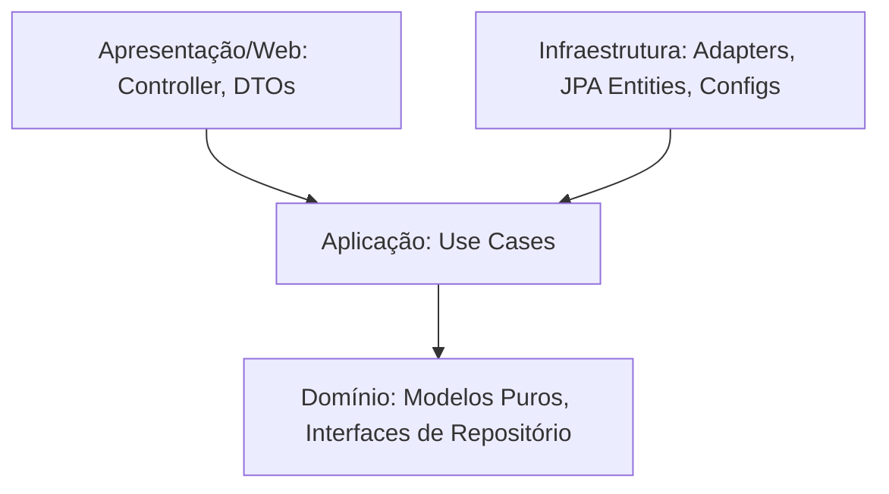

# Coupon Management API 🏷️

API robusta e escalável desenvolvida com **Java 17** e **Spring Boot** para gerenciamento de cupons de desconto. Este projeto foi estruturado utilizando princípios de **Arquitetura Limpa (Clean Architecture)** e **SOLID**, garantindo baixo acoplamento, alta testabilidade e fácil manutenção.

---

## 🏛️ Arquitetura do Projeto

O projeto segue as diretrizes da **Clean Architecture** (Arquitetura Limpa), dividindo o sistema em camadas bem definidas com regras claras de dependência (as camadas externas dependem apenas das camadas internas, e o Domínio não depende de ninguém).



### Divisão de Pastas e Camadas

*   **`domain` (Domínio - Core)**: 
    *   Contém a lógica de negócio central e as entidades de negócio puras (POJOs), completamente desacopladas de qualquer framework ou tecnologia de banco de dados (sem anotações JPA/Spring).
    *   `Coupon.java` centraliza e valida suas próprias regras (limpeza de código, desconto mínimo de 0.5, expiração no futuro, soft-delete).
    *   Define também a interface/porta de saída `CouponRepository.java` (Port).
*   **`application` (Aplicação - Casos de Uso)**:
    *   Orquestra os fluxos de dados do domínio. Cada intenção do usuário possui uma classe exclusiva (Use Case) de responsabilidade única (`CreateCouponUseCase`, `GetCouponUseCase`, `DeleteCouponUseCase`).
*   **`infrastructure` (Infraestrutura)**:
    *   Contém os detalhes tecnológicos de baixo nível: persistência no H2 (`CouponJpaEntity`, `SpringDataCouponRepository`), configurações globais de Beans (`BeanConfiguration`) e documentação Swagger (`SwaggerConfig`).
    *   Implementa o adaptador de persistência `JpaCouponRepositoryAdapter` que converte as entidades de domínio puro para JPA e vice-versa.
*   **`presentation` (Apresentação - REST/API)**:
    *   Trata as requisições HTTP, valida as entradas com Bean Validation (`CouponRequest`), formata as saídas (`CouponResponse`) e centraliza erros no `GlobalExceptionHandler`.

---

## 📐 Princípios SOLID Aplicados

A arquitetura foi desenhada em torno do SOLID para garantir um código limpo e de fácil manutenção:

*   **S - Single Responsibility Principle (Princípio da Responsabilidade Única)**:
    *   Evitamos "services genéricos" gigantes. Cada caso de uso (ex: `CreateCouponUseCase`) realiza apenas uma ação focada.
    *   Separamos a entidade JPA (`CouponJpaEntity`) da entidade de domínio puro (`Coupon`), separando o comportamento de negócio do comportamento de persistência.
*   **O - Open/Closed Principle (Princípio Aberto/Fechado)**:
    *   O domínio e os casos de uso estão fechados para modificação direta, mas abertos para extensão.
    *   Se precisarmos migrar de H2/JPA para MongoDB ou Cassandra, criamos um novo adaptador que implementa a interface `CouponRepository` na infraestrutura, sem alterar uma única linha de código nos casos de uso.
*   **L - Liskov Substitution Principle (Princípio da Substituição de Liskov)**:
    *   A camada de aplicação depende da interface `CouponRepository`. Qualquer classe que a implemente (ex: `JpaCouponRepositoryAdapter`) pode substituí-la sem alterar o comportamento esperado da aplicação.
*   **I - Interface Segregation Principle (Princípio da Segregação de Interfaces)**:
    *   A interface `CouponRepository` é enxuta e coesa, contendo apenas os métodos essenciais exigidos pelas necessidades do domínio.
*   **D - Dependency Inversion Principle (Princípio da Inversão de Dependência)**:
    *   Nossos casos de uso de alto nível não dependem de detalhes de banco de dados (Spring Data/JPA). Em vez disso, dependem da abstração `CouponRepository` definida no Domínio. A infraestrutura é quem se adapta ao Domínio.

---

## 📈 Escalabilidade e Extensão (Ex: Adicionando Grafana e Observabilidade)

Devido ao desacoplamento da Clean Architecture, adicionar novos recursos, integrações ou ferramentas de infraestrutura é extremamente simples e seguro, sem riscos de introduzir bugs na regra de negócio.

### Caso prático: Como adicionar Monitoramento com Prometheus e Grafana?

Para adicionar métricas e monitoramento ao projeto, você realizaria as alterações **exclusivamente na camada de infraestrutura**, deixando o domínio e a lógica de negócios intocados:

1.  **Dependências**: Adicione no [pom.xml](file:///C:/dev/java/coupon-management-api/pom.xml) o Spring Boot Actuator e o Micrometer Prometheus:
    ```xml
    <dependency>
        <groupId>org.springframework.boot</groupId>
        <artifactId>spring-boot-starter-actuator</artifactId>
    </dependency>
    <dependency>
        <groupId>io.micrometer</groupId>
        <artifactId>micrometer-registry-prometheus</artifactId>
        <scope>runtime</scope>
    </dependency>
    ```
2.  **Configuração de Infraestrutura**: Em `application.properties`, configure a exposição das métricas:
    ```properties
    management.endpoints.web.exposure.include=health,info,prometheus
    ```
3.  **Docker Compose**: No [docker-compose.yml](file:///C:/dev/java/coupon-management-api/docker-compose.yml), adicione os serviços do Prometheus e Grafana:
    ```yaml
      prometheus:
        image: prom/prometheus
        volumes:
          - ./prometheus.yml:/etc/prometheus/prometheus.yml
        ports:
          - "9090:9090"

      grafana:
        image: grafana/grafana
        ports:
          - "3000:3000"
    ```

Desta forma, todo o sistema de telemetria é acoplado por fora da aplicação (concerns transversais), mantendo o código de negócios intacto.

---

## 🚀 Como Rodar o Projeto

### Pré-requisitos
*   **Java 17** instalado localmente
*   **Maven 3.8+** ou uso do wrapper (`mvnw`) incluído
*   **Docker** e **Docker Compose** instalados (opcional para execução em containers)

### 💻 Executando Localmente (Desenvolvimento)
Abra o terminal na pasta raiz do projeto e execute:
```bash
# Compilar e rodar a aplicação
.\mvnw.cmd spring-boot:run
```
A API estará disponível no endereço: `http://localhost:8080`

### 🐳 Executando via Docker
Caso queira subir o projeto em container Docker:
```bash
# Parar containers antigos caso haja algum rodando
docker-compose down

# Reconstruir a imagem e subir o container
docker-compose up --build
```
A API estará mapeada e exposta no endereço do host em: `http://localhost:8080`

### 🧪 Executando os Testes
A suíte inclui 23 testes unitários e de integração cobrindo 100% das regras de negócio do desafio:
```bash
# Rodar todos os testes automatizados
.\mvnw.cmd test
```

---

## 📖 Endpoints e Documentação da API

### Documentação (Swagger UI)
Com a aplicação rodando, acesse a documentação interativa para teste de rotas em:
👉 **`http://localhost:8080/swagger-ui.html`**

### Banco de Dados (H2 Console)
Para inspecionar as tabelas criadas em memória pelo JPA:
👉 **`http://localhost:8080/h2-console`**
*   **JDBC URL**: `jdbc:h2:mem:coupondb`
*   **User**: `sa`
*   **Password**: (em branco)

*Nota: Ao acessar o H2 Console no navegador, digite a URL exatamente sem barra final (`/h2-console`) para garantir o redirecionamento adequado do servlet Tomcat.*
